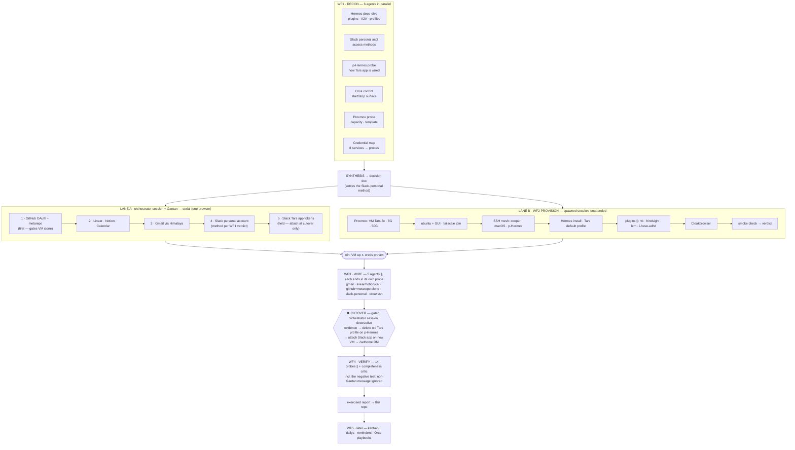

# PLAN — the Tars build, as a run graph

Designed 2026-08-07 (see [docs/conversation-2026-08-07.md](docs/conversation-2026-08-07.md)).
Visual: [docs/graph.html](docs/graph.html) · live artifact:
<https://claude.ai/code/artifact/eadbfef8-7526-41e1-b27b-0703a61b8693>

Five chained workflows with the orchestrator session (Claude + Gaetan) as the decision point
between them. Two constraints shape everything:

1. **Auth needs Gaetan's logged-in browser, and the browser is main-session-only** (subagent
   typing lands in the active tab). So credential acquisition is a serial human lane, never a
   workflow node.
2. **The Slack-app cutover is destructive** (deletes the old Tars profile on personal Hermes).
   It is a gated inline step, never inside an unattended graph.

## The graph

Each credential acquired in lane A immediately fans out an **async probe agent** to test it, then
lands in SOPS/1Password — acquisition stays serial, testing never blocks it.

## Phases

| Phase | Mechanism | Notes |
|---|---|---|
| WF1 recon | 6 agents ∥, barrier, synthesis | Barrier justified: the Slack-personal verdict and Hermes install facts gate the whole plan. Output = decision doc committed here. |
| Lane A creds | orchestrator session, serial + async probes | Order by what gates other work: GitHub first (VM needs it to clone mc-metarepo), Slack app tokens last (held for cutover). Store via SOPS/1Password, never in argv, never in this repo. |
| Lane B = WF2 | sequential chain, one ∥ plugin fan-out | Runs unattended in a spawned session. Each step consumes the previous verdict, not logs. Ends with its own smoke check. |
| WF3 wire | 5 wiring agents ∥ after the join | Independent per service; each ends in its own probe. Includes the metarepo clone and Orca/SSH target wiring. |
| Cutover | inline, gated, evidence-first | The only step touching the running personal Hermes. Nothing is deleted until the new side is provisioned, wired and smoke-tested. `/sethome` DM set here. |
| WF4 verify | 14 probes ∥ + critic, barrier, report | Every capability exercised once with evidence before Tars is declared live ("done is not exercised"). Includes the negative test: a message from someone who isn't Gaetan must be ignored. Gaps found by the critic loop back as new probes. |
| WF5 behaviors | later milestone | Kanban, dailys, reminders, reports, Orca orchestration playbooks. Off the critical path; designed once Tars answers in Slack. GBrain / mc-kestra data also postponed (per pitch). |

**Critical path:** WF1 → max(lane A, lane B) → WF3 → cutover → WF4. Lane A is the long pole —
the only part that needs a human.

## Execution model — hub-and-spoke (decided)

One **orchestrator session** (the only one Gaetan touches):

1. Runs WF1 in-process as a Workflow (fan-outs are what the Workflow tool is for) → commits the
   decision doc here.
2. **Spawns lane B itself** as a second Orca session with a pointer prompt — own worktree,
   unattended. Gaetan never manages it.
3. Runs lane A interactively (browser + Gaetan) while lane B runs elsewhere.
4. On lane B's done-ping: WF3 in-process → hold for Gaetan's go at the cutover → WF4 in-process.

Rejected alternatives, for the record:

- *Solo session, everything in-process*: background workflows don't survive a context handoff
  (workflow resume is same-session-only); one session accumulating recon + browser noise +
  provisioning will hit the 50% handoff threshold and orphan an in-flight WF2.
- *One mega-workflow*: WF3 depends on lane A's credentials and a workflow can't pause for a
  human — the graph would deadlock. Chain-of-workflows is the correct compilation, not a
  limitation.
- *Herdr-pane fleet / manual 2 sessions*: re-adds manual multiplexing for zero gain over one
  spawned session.

## Coordination contract

- **The prompt is a pointer, the plan lives in the repo.** Both sessions read PLAN.md; prompts
  only assign a role. Survives handoffs (both sessions inherit the 50%-context handoff rule).
- **Single writer per status file** — merge conflicts made structurally impossible:
  - `status/lane-a.md` — orchestrator session only. Append-only log + credential checklist
    (1Password/SOPS item *names*, never values).
  - `status/lane-b.md` — lane-B session only. Provisioning verdicts: VM specs, tailscale
    hostname, SSH fingerprints, plugin versions, smoke-check evidence.
- Both commit to `main`, `git pull --rebase` before push. No branch-per-lane ceremony.
- **Done-signal:** lane B pings the orchestrator via SendMessage; the repo commit is the durable
  fallback if either session is gone when the ping fires.
- No TODO.md / ROADMAP.md: the lanes' todos are the workflow phases above; a second tracking
  surface would drift from the first.

### Lane prompts (pointer form)

> **Lane A / orchestrator:** "You are the Tars orchestrator. Read PLAN.md. Run WF1 if not done,
> commit results. Then execute lane A (credential acquisition — you have my browser), logging to
> status/lane-a.md. When lane B pings you done, run WF3, then hold for my go on the cutover."

> **Lane B:** "You are the Tars provisioning worker. Read PLAN.md and execute lane B (WF2) only.
> Log verdicts to status/lane-b.md, commit as you go. When the smoke check passes, SendMessage
> the orchestrator session and stop. Do not touch credentials, the browser, or personal Hermes
> beyond read-only."

## Guardrails

- Credentials never land in this repo — SOPS/1Password; status files reference item names only.
- Lane B never writes to personal Hermes (read-only probe only); the destructive profile delete
  happens exactly once, inside the gated cutover, with before-evidence captured first.
- Tars never opens PRs, never implements — enforced later in its profile/system prompt (WF2
  scaffolds it, WF4 does not probe coding on purpose).
- Orca's own orchestration layer (runs, tasks, workers, decision gates) is available on cooper —
  candidate mechanism for the cutover gate and lane dispatch; evaluate during WF1 (Orca control
  node) rather than assuming.
