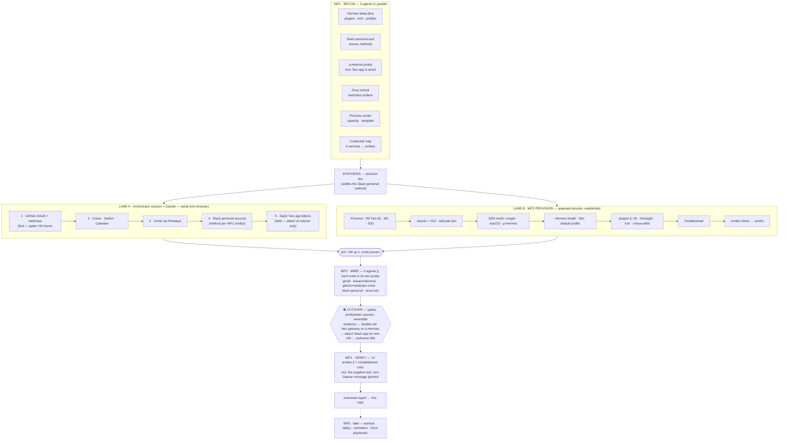

# PLAN — the Tars build, as a run graph

Designed 2026-08-07 (see [docs/conversation-2026-08-07.md](docs/conversation-2026-08-07.md)).
Visual: [docs/graph.html](docs/graph.html) · live artifact:
<https://claude.ai/code/artifact/eadbfef8-7526-41e1-b27b-0703a61b8693>

Five chained workflows with the orchestrator session (Claude + Gaetan) as the decision point
between them. Two constraints shape everything:

1. **Auth needs Gaetan's logged-in browser, and the browser is main-session-only** (subagent
   typing lands in the active tab). So credential acquisition is a serial human lane, never a
   workflow node.
2. **The Slack-app cutover flips a live surface** (stops the old Tars gateway on personal
   Hermes; the profile *delete* is deferred to a gated post-WF4 cleanup — see Amendments).
   It is a gated inline step, never inside an unattended graph.

## The graph

Each credential acquired in lane A immediately fans out an **async probe agent** to test it, then
lands in SOPS/1Password — acquisition stays serial, testing never blocks it.

**Model backend (decided 2026-08-07):** Hermes on the new VM runs on Gaetan's
`gaetan.cathelain@mobile.club` ChatGPT subscription, model **GPT 5.6 Sol**. The ChatGPT OAuth
login is one more lane-A browser credential (slot it after GitHub, alongside the other
Google/OAuth steps); lane B installs Hermes without it, and it gets wired to the profile in
WF3. Stored like every other credential — 1Password/SOPS, names only in status files.

## Phases

| Phase | Mechanism | Notes |
|---|---|---|
| WF1 recon | 6 agents ∥, barrier, synthesis | Barrier justified: the Slack-personal verdict and Hermes install facts gate the whole plan. R2/R6 read the mc-kestra prior art (below) before searching anywhere else. Output = decision doc committed here. |
| Lane A creds | orchestrator session, serial + async probes | Order by what gates other work: GitHub first (VM needs it to clone mc-metarepo), Slack app tokens last (held for cutover). Follow the mc-kestra walkthroughs (below) — only the storage differs. Store via SOPS/1Password, never in argv, never in this repo. |
| Lane B = WF2 | sequential chain, one ∥ plugin fan-out | Runs unattended in a spawned session. Each step consumes the previous verdict, not logs. Ends with its own smoke check. |
| WF3 wire | 5 wiring agents ∥ after the join | Independent per service; each ends in its own probe. Includes the metarepo clone and Orca/SSH target wiring. |
| Cutover | inline, gated, evidence-first | The only step touching the running personal Hermes: disable+stop the old tars gateway (frees the Slack token pair), attach the app on the new VM, `/sethome` DM. Rollback = re-enable the old unit. The profile *delete* is not here — it moved to a gated cleanup after WF4 + soak. |
| WF4 verify | 14 probes ∥ + critic, barrier, report | Every capability exercised once with evidence before Tars is declared live ("done is not exercised"). Includes the negative test: a message from someone who isn't Gaetan must be ignored. Gaps found by the critic loop back as new probes. |
| WF5 behaviors | later milestone | Kanban, dailys, reminders, reports, Orca orchestration playbooks. Off the critical path; designed once Tars answers in Slack. GBrain / mc-kestra data also postponed (per pitch). |

**Critical path:** WF1 → max(lane A, lane B) → WF3 → cutover → WF4. Lane A is the long pole —
the only part that needs a human.

### Prior art — mc-kestra auth walkthroughs

`~/dev/mc-kestra/SETUP.md` §5 "Per-source setup" is a colleague-grade, step-by-step credential
walkthrough — harvest → first run → healthy/failure signatures → gotchas — for **Slack
(personal account: `xoxc-` token + `xoxd-` cookie harvested from the logged-in web tab),
Gmail, Notion, GitHub, Linear**. `~/dev/mc-kestra/setup-calendar-section.md` is the same for
**Google Calendar**. That pre-answers ~6 of the 8 credential targets, including R2's "Slack
personal access method" question:

- WF1's R2/R6 agents read those two files FIRST and verify fit for Tars' runtime (Hermes on
  the new VM, not Kestra) instead of rediscovering methods from scratch.
- Lane A follows the same harvest steps; only the storage differs (1Password/SOPS, never
  mc-kestra's `.env` pattern).

## Execution model — hub-and-spoke (decided)

One **orchestrator session** (the only one Gaetan touches):

1. Runs WF1 in-process as a Workflow (fan-outs are what the Workflow tool is for) → commits the
   decision doc here.
2. **Spawns lane B itself** as a second Orca session with a pointer prompt — own Orca
   worktree, `orc-opus` (policy: sub-orchestrators run Opus), unattended. Gaetan never
   manages it. Mechanics in the coordination contract below.
3. Runs lane A interactively (browser + Gaetan) while lane B runs elsewhere. Gaetan's auth
   waits are work time: pre-stage WF3 wiring specs, the Tars profile/system-prompt draft
   (no-coding/no-PR rules baked in), and WF4 probe specs with background agents.
4. On lane B's done-ping: WF3 in-process → hold for Gaetan's go at the cutover → WF4 in-process.

Rejected alternatives, for the record:

- *Solo session, everything in-process*: background workflows don't survive a context handoff
  (workflow resume is same-session-only); one session accumulating recon + browser noise +
  provisioning will hit the 50% handoff threshold and orphan an in-flight WF2.
- *One mega-workflow*: WF3 depends on lane A's credentials and a workflow can't pause for a
  human — the graph would deadlock. Chain-of-workflows is the correct compilation, not a
  limitation.
- *Herdr-pane fleet / manual 2 sessions*: re-adds manual multiplexing for zero gain over one
  spawned session.

## Coordination contract

- **The prompt is a pointer, the plan lives in the repo.** Both sessions read PLAN.md; prompts
  only assign a role. Survives handoffs (both sessions inherit the 50%-context handoff rule).
- **Single writer per status file** — merge conflicts made structurally impossible:
  - `status/lane-a.md` — orchestrator session only. Append-only log + credential checklist
    (1Password/SOPS item *names*, never values).
  - `status/lane-b.md` — lane-B session only. Provisioning verdicts: VM specs, tailscale
    hostname, SSH fingerprints, plugin versions, smoke-check evidence.
- Both commit to `main`: `git pull --rebase origin main && git push origin HEAD:main` — a
  worktree branch cannot check out `main` itself. No branch-per-lane ceremony.
- **Spawn mechanics (hub → spoke):** `orca worktree create --name lane-b --repo
  path:<repo-root> --base-branch main --json` → read the new worktree path → `orc-tab start
  -w path:<new-path> orc-opus lane-b '<lane-B prompt below, hub session name filled in>'`.
  The `orc-opus` launcher appends ORCHESTRATION-POLICY.md itself (see its §9 — peer
  sessions); no binding line needed.
- **Pings:** lane B SendMessages the orchestrator at each milestone — VM created · Hermes
  installed · smoke pass (= the join signal) — and immediately on any blocker, not just a
  final done. The orchestrator may SendMessage lane B to steer or query it. The repo commit
  is the durable fallback if either session is gone when a ping fires.
- No TODO.md / ROADMAP.md: the lanes' todos are the workflow phases above; a second tracking
  surface would drift from the first.

### Lane prompts

**Lane A / orchestrator** — canonical copy of the `/start-orca` prompt:

> You are the Tars build orchestrator — the hub of the hub-and-spoke in PLAN.md, and lane A's
> executor: this session owns Gaetan's logged-in browser and is the only one he touches;
> nothing you spawn ever drives the browser. Read PLAN.md in full (run graph, prior art,
> coordination contract, spawn mechanics), then docs/conversation-2026-08-07.md § Open items.
> Then run the plan from the top:
>
> 1. Commit any pending PLAN.md amendments, push HEAD:main, clear the open items.
> 2. WF1 recon as an in-process Workflow — recon agents read the mc-kestra walkthroughs
>    (PLAN § prior art) first. Synthesize, commit the decision doc, push.
> 3. Spawn lane B per the contract's spawn mechanics — own Orca worktree, orc-opus, pointer
>    prompt with your session name filled in. Unattended; steer it via SendMessage only.
> 4. Lane A interactively: serial credential acquisition in PLAN order, you driving the
>    browser; pull Gaetan in only for passwords/2FA/consent screens. Each credential: async
>    probe agent, then 1Password/SOPS — names only in status/lane-a.md. During Gaetan's
>    waits, pre-stage WF3 wiring specs, the Tars profile draft, WF4 probe specs.
> 5. On lane B's smoke-pass ping: WF3 wire in-process.
> 6. STOP at the cutover — destructive (deletes the old Tars profile on personal Hermes).
>    Evidence first, Gaetan's explicit "go" in this session, only then cut over; then WF4
>    verify and the exercised report, committed.
>
> Secrets never in repo/argv/echo (op-pipe per your global prefs). Lane B and every agent:
> read-only on personal Hermes. Ping Gaetan only at decision points; verdicts, not logs.

**Lane B** — spawned by the orchestrator, hub session name filled in:

> You are the Tars provisioning worker — a spoke. Read PLAN.md at the repo root; you execute
> lane B (WF2) only. Log verdicts to status/lane-b.md — your only writable file — commit as
> you go, push HEAD:main. SendMessage the orchestrator session "<HUB-SESSION-NAME>" at each
> milestone (VM created · Hermes installed · smoke pass) and immediately on any blocker; stop
> after the smoke-pass ping. Do not touch credentials, the browser, or personal Hermes beyond
> read-only probes.

## Amendments — 2026-08-07 grill (post-WF1, settled with Gaetan)

Where these conflict with the graph or prose above, they win. Detail in `docs/recon/DECISION.md`.

- **Model backend:** ChatGPT-subscription consumption is proven live — personal Hermes runs on
  the ChatGPT 5.6 sub today. R7 (`docs/recon/r7-model-backend.md`) documents the wiring; lane A
  *replicates* it on the new VM. DECISION Blocker 1 is a replication task, not a feasibility
  question.
- **Cutover:** disable-only (the Slack token pair frees when the old gateway stops). Profile
  deletion is a separate, gated cleanup after WF4 passes + soak.
- **Store:** SOPS+age only; 1Password is out of the build path (D5).
- **Profile:** the new Hermes uses the **default profile** (`~/.hermes`) as Tars — never
  `hermes profile create` (known bug class when no default profile exists). One agent per box.
- **D6 deviations 1–7 accepted** (Calendar rides the Gmail app password; Docker lands in B2;
  minimal X, no xrdp; tailscale additive on `workstation-vm`, LAN primary; GitHub PAT 1-year
  expiry + reminder; A2A inbound-only).

## Guardrails

- Credentials never land in this repo unencrypted — SOPS/age (`secrets/tars.sops.yaml`); status
  files reference item names only.
- Lane B never writes to personal Hermes (read-only probe only); the cutover only *disables* the
  old tars gateway (rollback = re-enable); the profile delete happens exactly once, in a gated
  post-WF4 cleanup, with before-evidence captured first.
- Tars never opens PRs, never implements — enforced later in its profile/system prompt (WF2
  scaffolds it, WF4 does not probe coding on purpose).
- Orca's own orchestration layer (runs, tasks, workers, decision gates) is available on cooper —
  candidate mechanism for the cutover gate and lane dispatch; evaluate during WF1 (Orca control
  node) rather than assuming.
